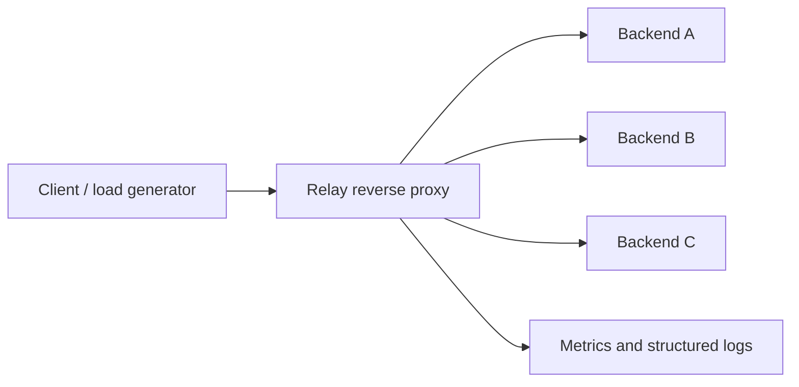

# Relay

A reverse proxy engineering project focused on predictable behavior under load and upstream failure.

**Status:** Working Go implementation with integration tests and a local failure demo. Performance benchmarks and a hosted portfolio presentation are still pending.

## Run locally

Requires Go 1.23 or newer. On Windows, the demo script also detects the project-local toolchain at `.tools/go`.

```powershell
.\scripts\demo.ps1
```

In another PowerShell terminal:

```powershell
# Confirm initial health probes have completed.
Invoke-RestMethod http://127.0.0.1:9090/readyz

# Observe round-robin backend identities.
1..6 | ForEach-Object { Invoke-RestMethod http://127.0.0.1:8080/orders }

# Make bravo fail its health checks; after two probes it is excluded.
Invoke-RestMethod -Method Post http://127.0.0.1:8082/demo/fail
Start-Sleep -Seconds 3
1..6 | ForEach-Object { Invoke-RestMethod http://127.0.0.1:8080/orders }

# Recover bravo and inspect backend health and latency metrics.
Invoke-RestMethod -Method Post http://127.0.0.1:8082/demo/recover
Invoke-RestMethod http://127.0.0.1:9090/metrics

# Exercise the 10-second request timeout (returns HTTP 504).
Invoke-WebRequest 'http://127.0.0.1:8080/orders?delay=15s'
```

Ctrl+C in the first terminal stops the demo. Ports 8080–8083 and 9090 must be free. All demo listeners bind to loopback. The demo backend control endpoints are intentionally unauthenticated and must remain local; they can also be reached through the demo proxy.

For an automated executable smoke check, run `.\scripts\smoke.ps1`. It verifies traffic distribution, backend exclusion, and recovery, then stops its child processes.

With Go on PATH, the cross-platform manual equivalent is to run these commands in four terminals:

```sh
go run ./cmd/backend -name alpha -listen 127.0.0.1:8081
go run ./cmd/backend -name bravo -listen 127.0.0.1:8082
go run ./cmd/backend -name charlie -listen 127.0.0.1:8083
go run ./cmd/relay -config config/relay.json
```

## Verify

```sh
go test -count=1 -timeout=60s ./...
go vet ./...
go build ./...
go test -race -count=1 -timeout=60s ./...
```

The race detector requires a supported native C compiler. CI runs it on Linux. For the project-local Windows toolchain, use `.\.tools\go\bin\go.exe` instead of `go` and set `$env:GOCACHE = "$PWD\.cache\go-build"` if your environment restricts cache writes.

## Implemented behavior

Open **http://127.0.0.1:9090/** or **http://127.0.0.1:9090/metrics** in a browser for the live dashboard. It refreshes every two seconds and shows request throughput, cumulative success rate and average latency, status counts, concurrency usage, and backend health. Pause updates to inspect a snapshot. Traffic history is local to the browser session; counters reset with the proxy.

Prometheus can still scrape `/metrics`. The `/metrics/raw` endpoint always returns plain text, and `/api/stats` supplies the dashboard's JSON snapshot. Restart the demo after changing Go or embedded dashboard files.

- Longest path-prefix routing with segment boundaries and round-robin backend selection.
- Streaming HTTP forwarding using Go's `httputil.ReverseProxy`; query values are preserved, though their encoding may be normalized.
- Active health probes with consecutive success/failure thresholds and passive transport-failure observations.
- A global concurrency limit with immediate HTTP 503 overload rejection, and bounded request duration.
- Generated request IDs, rebuilt forwarding headers, JSON access logs, and Prometheus-format counters, latency histograms, and health gauges.
- Separate loopback admin listener, startup config validation, and shutdown draining on Ctrl+C or SIGTERM.

Requests return 503 until a backend passes its first health probe. Application HTTP 500 responses do not independently mark a backend unhealthy. There are no application-level retries; Go's transport can retry some requests under its own connection-reuse and idempotency rules.

## Current limits

Static configuration; one proxy process; no inbound TLS, client rate limiting, circuit breaker, or dynamic discovery. CONNECT and protocol upgrades are rejected. Streams share the configured request deadline. A failure after headers were sent aborts the response rather than changing its status. The concurrency cap bounds forwarded requests, not all accepted client sockets. Synchronous log output can become a bottleneck. Do not claim production readiness or benchmark numbers yet.

## What we are building

Relay sits between clients and a configurable pool of HTTP services. It routes requests, distributes traffic, isolates unhealthy backends, and exposes enough telemetry to explain what happens during a failure.



The project is intended to demonstrate systems design, implementation, testing, and performance investigation. It is not currently production software.

## Delivery milestones

| Milestone | Deliverable | Evidence required |
| --- | --- | --- |
| 1. Working data path | Config validation, path routing, round-robin balancing, streaming HTTP forwarding, deadlines, graceful shutdown | Integration tests using real local HTTP backends; one-command local demo |
| 2. Failure handling | Active health checks, passive failure tracking, bounded concurrent requests, explicit overload responses | Backend outage and recovery tests; cancellation tests; load shedding demo |
| 3. Observability | Request IDs, structured access logs, request and error counters, latency histograms, backend health | Recorded traffic and failure scenarios with observable results |
| 4. Performance | Reproducible load tests and direct-backend baseline | Throughput, p50/p95/p99 latency, error rate, CPU and memory with environment and commands documented |
| 5. Portfolio release | Architecture write-up, decision records, demo recording, CI, measured case study | Clean checkout instructions work; all published claims trace to test or benchmark evidence |

## Scope boundaries

Start with one proxy process, static configuration, and HTTP upstreams. TLS certificate automation, distributed rate limiting, dynamic service discovery, response caching, and a management UI are later candidates, not first-release requirements.

Use a mature HTTP forwarding library for protocol correctness. Implement routing policy, backend selection, health state, overload handling, telemetry, and lifecycle management ourselves.

## Interview questions this project should answer

- What happens when a backend accepts a connection but stops responding?
- How do you distinguish backend failure from a client cancelling a request?
- How do you avoid repeatedly sending traffic to a dead backend, and safely detect recovery?
- What is bounded when traffic exceeds capacity: requests, connections, queues, or all three?
- Why can retrying a POST duplicate an operation? What failures permit a safe retry?
- What changes when requests have long-lived streaming responses?
- How do you prevent clients from spoofing forwarding headers?
- How much overhead does the proxy add relative to a direct backend request?

See [the design](docs/design.md) for the intended behavior and verification plan.
