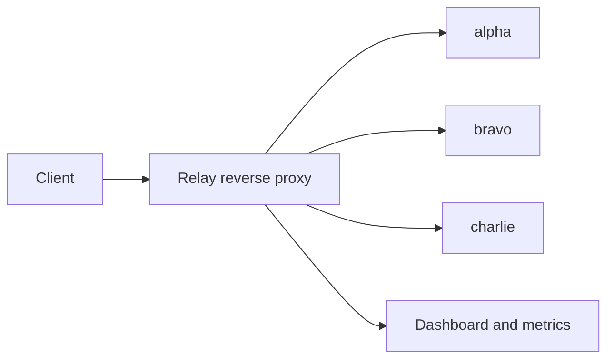

# Relay

[](https://github.com/HVKS07/relay/actions/workflows/ci.yml)

An HTTP reverse proxy written in Go, with load balancing, health checks, and a live metrics dashboard.

I built Relay to explore how a proxy behaves when traffic increases or a backend stops responding. The project focuses on routing requests, keeping unhealthy services out of rotation, and making those decisions visible through logs and metrics.

## How it works



Relay matches the longest configured path prefix and distributes requests across healthy backends using round robin. Health probes remove unavailable backends and bring them back after recovery. Requests have a deadline, and a concurrency limit prevents an unbounded queue of forwarded work.

HTTP forwarding uses Go's `httputil.ReverseProxy`. Routing, backend selection, health tracking, admission limits, and the dashboard are implemented around it.

## Features

- Path-based routing with segment boundaries: `/api` matches `/api/orders`, but not `/apiculture`.
- Round-robin balancing across healthy backends.
- Active health checks with configurable success and failure thresholds.
- Streaming responses, request timeouts, cancellation propagation, and graceful shutdown.
- Concurrency limits with explicit overload responses.
- Generated request IDs, structured access logs, and Prometheus-format metrics.
- A dashboard showing throughput, average latency, response codes, and backend health.
- Docker Compose setup with Caddy, private backends, and a restricted public demo interface.

## Quick start

### Docker

Requires Docker with Compose and Linux container support.

```sh
git clone https://github.com/HVKS07/relay.git
cd relay
docker compose up --build --wait
```

Open [localhost:8088](http://localhost:8088) and click **Send demo request**. Each click sends one request through Relay and shows which backend handled it.

The default configuration binds to localhost. Only Caddy publishes host ports; the backend services and admin listener stay private. The demo endpoint is rate-limited and does not accept custom paths, bodies, or upstream URLs.

Stop the stack with:

```sh
docker compose down
```

See [deployment notes](docs/deployment.md) for HTTPS configuration, limits, and rollback instructions.

### Go

Requires Go 1.23 or newer on PATH. From the repository root, run these commands in four separate terminals:

```sh
go run ./cmd/backend -name alpha -demo-controls -listen 127.0.0.1:8081
go run ./cmd/backend -name bravo -demo-controls -listen 127.0.0.1:8082
go run ./cmd/backend -name charlie -demo-controls -listen 127.0.0.1:8083
go run ./cmd/relay -config config/relay.json
```

On Windows, the demo script builds and starts all four processes:

```powershell
.\scripts\demo.ps1
```

Open the [local dashboard](http://127.0.0.1:9090/). Send traffic to `http://127.0.0.1:8080/orders`. The dashboard refreshes every two seconds; counters reset when Relay restarts.

The `-demo-controls` flag enables unauthenticated failure controls for local testing. Keep those listeners on loopback. The Docker setup leaves these controls disabled.

## Try a backend failure

With Docker running, send a few requests from the dashboard, then stop bravo:

```sh
docker compose stop bravo
```

After the health-check threshold is reached, bravo is excluded and requests alternate between alpha and charlie. Bring it back with:

```sh
docker compose start bravo
```

Once its probe succeeds, bravo rejoins the rotation.

For the Go/PowerShell demo, use a second terminal:

```powershell
# Send traffic across all three backends.
1..6 | ForEach-Object { Invoke-RestMethod http://127.0.0.1:8080/orders }

# Fail bravo and allow health probes to detect it.
Invoke-RestMethod -Method Post http://127.0.0.1:8082/demo/fail
Start-Sleep -Seconds 3
1..6 | ForEach-Object { Invoke-RestMethod http://127.0.0.1:8080/orders }

# Restore bravo.
Invoke-RestMethod -Method Post http://127.0.0.1:8082/demo/recover
```

## Design decisions

**Bound work instead of building a queue.** When the forwarding concurrency limit is reached, Relay returns `503`. This bounds in-flight proxy work, though it does not cap every accepted client connection.

**Keep retries explicit.** Relay adds no application-level retries because an upstream failure can leave the outcome of a write unknown. Go's transport may still retry eligible requests under its own rules.

**Separate health from application errors.** A valid HTTP `500` response does not automatically mark a backend unhealthy. Active probes and transport failures determine eligibility; client cancellation does not count as a backend failure.

**Handle failures according to response state.** Before headers are sent, an upstream transport failure returns `502` and a deadline expiry returns `504`. After headers are sent, a stream failure terminates the response and is recorded separately.

Linux CI caught an edge case here: a socket deadline could fire before the context timer, causing a timeout to be classified as `502`. The error handler now also checks the elapsed deadline.

More detail is in the [design notes](docs/design.md).

## Tests

```sh
go test -count=1 -timeout=60s ./...
go test -race -count=1 -timeout=60s ./...
go vet ./...
go build ./...
```

The race detector requires a supported C compiler. GitHub Actions runs race tests and builds on Linux with Go 1.23.x and the current stable release.

Integration tests cover forwarding, header trust, route matching, balancing, health transitions, timeouts, overload, cancellation, streaming, and shutdown draining. CI also starts the Docker stack and checks public endpoint isolation, routing, backend failure, and recovery.

To run the Docker smoke check locally:

```sh
python scripts/compose-smoke.py
```

This check temporarily stops bravo, so run it against a local test stack. The Windows equivalent for the native demo is `scripts/smoke.ps1`.

## Current limits and next steps

Relay currently uses static configuration and a single proxy process. It does not support CONNECT, protocol upgrades, dynamic service discovery, or distributed rate limiting. TLS is handled by Caddy in the deployment setup. Streams share the configured request deadline, and metrics are stored in memory.

The project is not publicly hosted yet. My next step is benchmarking direct backend requests against proxied requests, including throughput, p95/p99 latency, errors, and resource usage. Performance results are not available yet.
