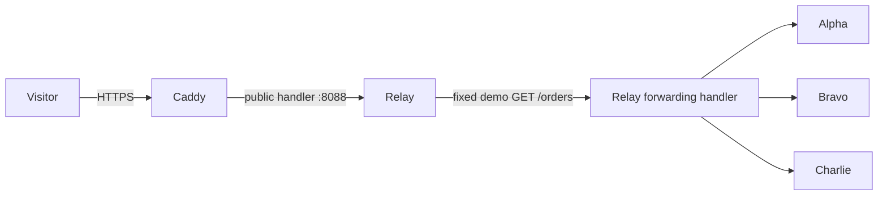

# Running and deploying the public demo

## Local Docker demo

Install Docker Engine with the Compose plugin, or Docker Desktop with Linux containers. From the repository root:

```sh
docker compose up --build --wait
```

Open http://localhost:8088 and click **Send demo request**. This sends one fixed GET through Relay to a demo backend. Docker defaults bind only to loopback, so this command does not expose your computer to the internet.

```sh
python scripts/compose-smoke.py
docker compose down
```

The smoke check briefly stops bravo and restores it; run it on a disposable local/CI stack. It is not a load benchmark.

## Architecture



Caddy handles TLS and forwards to a dedicated public listener. It cannot reach the loopback-only data/admin listeners. Backends share an internal Docker network with Relay; they publish no host ports. Relay and backend containers run as a non-root user with read-only filesystems, dropped capabilities, resource limits, and rotated logs.

The public listener serves only the dashboard, sanitized stats, metrics text, and `POST /demo/request`. It does not forward arbitrary URLs or paths. Demo requests have no visitor body, query parameters, cookies, or authorization headers. Limits per Relay process are 2 demo requests/second with a burst of 4 and at most 4 concurrent demo requests; the entire public listener has a 30 requests/second limit with a burst of 60. These shared limits intentionally favor resource bounds over per-visitor fairness. They are not distributed rate limiting or DDoS protection.

Backend failure controls require the explicit `-demo-controls` flag, which the container setup does not enable. An operator can demonstrate failure with `docker compose stop bravo` and recovery with `docker compose start bravo`. The dashboard observes the actual probe state.

## Deploy on a Linux VM

No cloud resources have been provisioned by this change. You need a VM with Docker/Compose, a domain or subdomain, and permission to manage DNS and firewall rules.

1. Clone this repository on the VM and check out the reviewed deployment commit.
2. Copy `.env.example` to `.env` and set:

   ```dotenv
   SITE_ADDRESS=relay.your-domain.com
   BIND_ADDRESS=0.0.0.0
   HTTP_PORT=80
   HTTPS_PORT=443
   ```

3. Point the domain's DNS A record to the VM. Only set an AAAA record if IPv6 is correctly configured.
4. Allow inbound TCP 80 and 443. Restrict SSH to your administration sources. Do not publish Relay/backend ports.
5. Run `docker compose up --build --wait`. Caddy obtains and renews the certificate; preserve the `caddy_data` volume across updates.
6. Open your HTTPS domain, send demo requests, and inspect `docker compose logs --tail 100` if something fails.

Official references: [Caddy automatic HTTPS](https://caddyserver.com/docs/automatic-https), [Caddy reverse proxy](https://caddyserver.com/docs/caddyfile/directives/reverse_proxy), [Compose networking](https://docs.docker.com/compose/how-tos/networking/).

## Updates and limitations

Use `docker compose up --build -d` after checking out a reviewed commit. To roll back, check out the previously deployed commit and rebuild. This single-instance process can interrupt traffic; it is not a zero-downtime rollout. `docker compose down` retains named volumes unless explicitly told to remove them.

Images use major release tags to receive updates; pin reviewed digests when producing a reproducible release. TLS issuance requires working DNS and public port reachability and cannot be verified by the local HTTP smoke check. Readiness is checked by Docker, but an unhealthy status alone does not restart a running process. A crashed process is restarted by the configured restart policy.

The public dashboard intentionally reveals configured demo names, route prefixes, and aggregate activity; origins and logs are not exposed. Host/edge connection exhaustion and larger public audiences require separate capacity planning. Load benchmarks and multi-instance failover remain future work.
